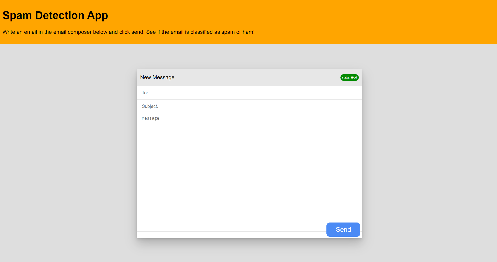

# Spam Detection App

An application that can determine if an email is spam or not. This project contains a spam detection model, an email tranformer, a fastAPI backend and a react front end.

This project is inteneded to be a demonstration of how to deploy an ML model using FastApi and also an opportunity for me to learn abit of React. The React app provides a user interface for clients to write emails and send them to the spam detection model to be checked. 

Obviously a real spam detection app would not work this way - I just wanted to practice some ML and React at the same time.

**An Email Transformer**

Fit on 2400 emails. For each email creates a vector that captures the frequency of 1,000 most popular words in the corpus and counts the frequency of words not in corpus in position 0. 

**Spam Detection Model**

Currently a logistic regression model trained on the word count vectors provided by the transformer. Cross validation mean score was 98% - however this was using the easy Spam dataset - I plan to use the harder to dataset and put more time into the modelling phase.

**FastApi Backend**

A simple backend that loads the transformers and the model from pckl files. There is one endpoint the /predict/ end point. This endpoint expects a the request body to contain a content attribute and the value should be email body. This body is then transformed into a vector and a prediction is made using the fitted logisitic regression model

**React Frontend**

A simple React front end with only two components: App and EmailComposer. The email composer contains the logic to send post requests to the API. If the api returns a classification of 1 then the email is spam, otherwise it is ham. The model prediction is indicated by the status tab in the top right of the image composer see below.

**Blank App**

**Spam Email**

